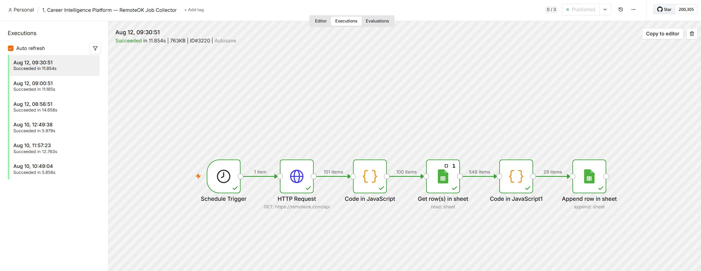
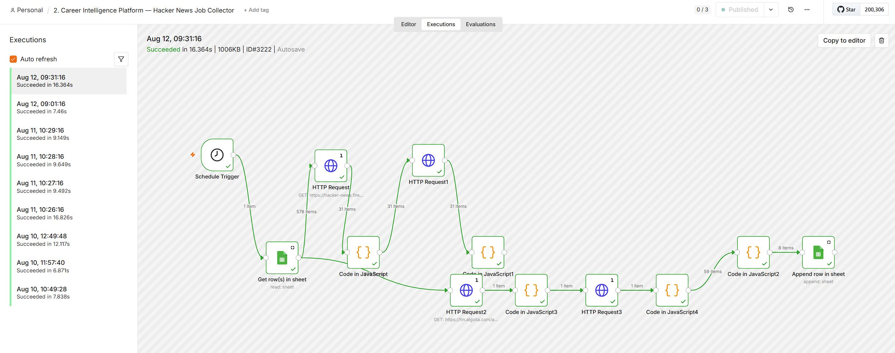
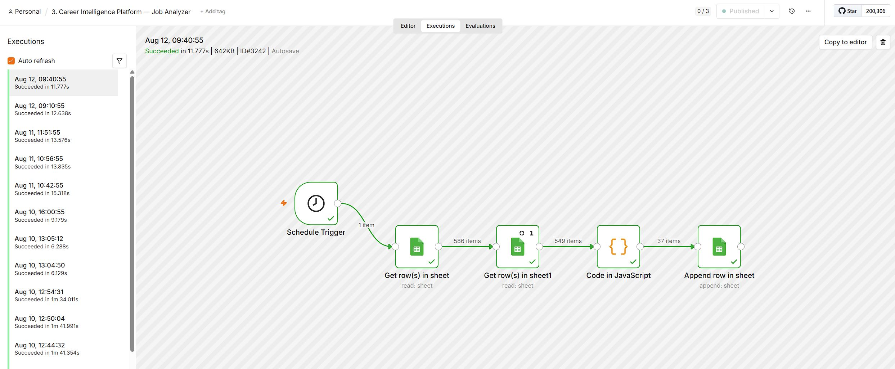
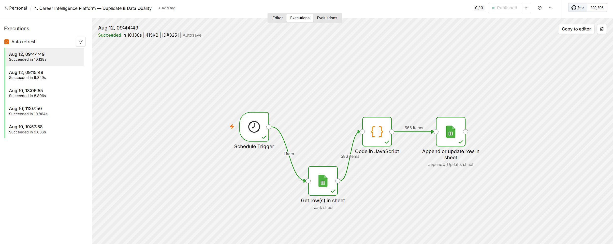
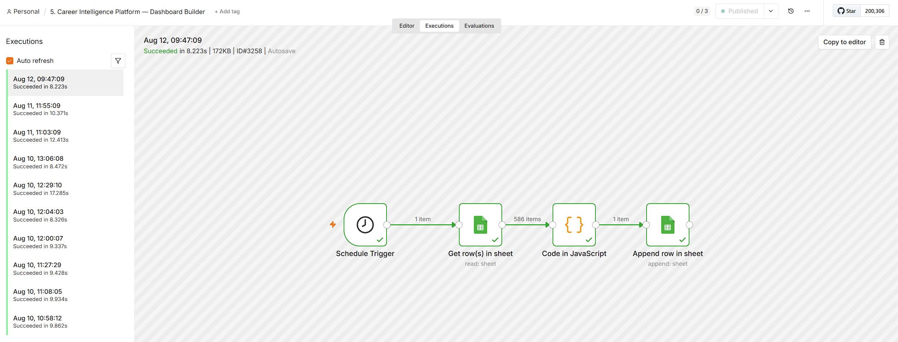
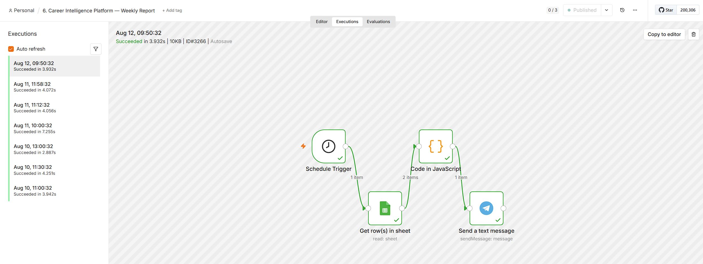

# Career Intelligence Platform

Автоматизированная система сбора и анализа вакансий на n8n. Шесть воркфлоу собирают вакансии из открытых источников, размечают их по навыкам и грейдам, чистят от дублей, считают аналитику по рынку труда и присылают еженедельный отчёт в Telegram.

Всё работает по расписанию без участия человека.

---

## Архитектура

```
RemoteOK API ─┐
              ├─→ [Jobs] ─→ разметка ─→ [Analyzed Jobs] ─→ агрегация ─→ [Analytics] ─→ Telegram
Hacker News ──┘                              ↑
                                        дедупликация
```

Данные проходят четыре стадии, каждая живёт на отдельном листе Google-таблицы:

| Стадия | Лист | Что содержит |
|---|---|---|
| Сбор | `Jobs` | Сырые вакансии как пришли из источников |
| Разметка | `Analyzed Jobs` | Те же вакансии + навыки, грейд, категория |
| Агрегация | `Analytics` | По одной строке в день: срез метрик рынка |
| Доставка | Telegram | Текстовый отчёт раз в неделю |

Разделение по листам даёт важное свойство: любой этап можно перезапустить независимо, не трогая остальные.

## Технологии

- **n8n** — оркестрация, расписания, обработка данных
- **Google Sheets API** — хранилище (OAuth2)
- **Telegram Bot API** — доставка отчётов
- **JavaScript** — вся бизнес-логика в Code-нодах
- **REST API** источников: RemoteOK, Hacker News (Firebase)

## Расписание

| Время | Воркфлоу | Почему именно так |
|---|---|---|
| 09:30 | Сбор из RemoteOK | Утро: за ночь у источника накопились новые объявления |
| 09:31 | Сбор из Hacker News | Минутой позже: оба пишут в один лист, одновременная запись — гонка |
| 09:40 | Разметка | Десять минут на сбор с запасом: разметка не должна начаться раньше, чем закончится запись |
| 09:44 | Чистка дублей | Сразу после разметки — данные уже приведены к одному виду |
| 09:47 | Пересчёт аналитики | На очищенных данных |
| Ср 09:50 | Отчёт в Telegram | Сводка пересчитана двумя минутами раньше |

Дальше в описании каждого воркфлоу время не повторяется — только эта таблица.
Иначе при следующем изменении расписания придётся править семь мест, и
какое-нибудь обязательно отстанет.

**Почему интервалы разные.** Между сбором и разметкой десять минут, между
остальными шагами три-четыре. Дело не в аккуратности чисел, а в длительности:
сбор ходит в два внешних API и пишет в таблицу — это единицы-десятки секунд,
и на медленной сети может затянуться. Разметка, чистка и сводка работают
с уже прочитанными данными и отрабатывают за секунды. Запас нужен там, где
результат зависит от чужих серверов.

**Почему всё утром, а не ночью.** Напрашивается разнести этапы по суткам:
сбор утром, разметка вечером, чистка и аналитика ночью — нагрузка распределена,
никто никому не мешает. Для системы на постоянно работающем сервере так и надо.

Здесь другое ограничение: система развёрнута на домашнем компьютере, а n8n
не выполняет пропущенное. Если в момент срабатывания расписания сервис
не запущен, запуск не откладывается и не догоняется — он просто не происходит.
Любой этап, назначенный на время, когда машина выключена, выпадает из цепочки,
и следующий работает по вчерашним данным.

Поэтому вся цепочка укладывается в двадцать минут одного утра — в промежуток,
когда компьютер заведомо включён. Отчёт в среду описывает сегодняшнее утро,
а не вчерашний вечер.

---

# Воркфлоу 1. RemoteOK Job Collector

**Назначение:** ежедневно забирает вакансии с RemoteOK и добавляет в таблицу те, которых там ещё нет.

**Место в цепочке:** первый шаг — сбор (см. таблицу расписания).

```
Schedule Trigger → HTTP Request → Code in JavaScript
   → Get row(s) in sheet → Code in JavaScript1 → Append row in sheet
```



### Разбор по шагам

**1. Schedule Trigger** — запускает воркфлоу утром. Без него всё пришлось бы нажимать руками.

**2. HTTP Request** — `GET https://remoteok.com/api`. Открытый API, ключ не нужен.

**3. Code in JavaScript** — приводит ответ к единому виду.

Первый элемент ответа RemoteOK — не вакансия, а юридическое уведомление, поэтому он отбрасывается (`slice(1)`). Дальше каждая вакансия раскладывается по полям: `job_id`, `date`, `source`, `company`, `position`, `location`, `tags`, `link`, `description`.

Два момента, ради которых шаг и нужен: теги приходят массивом и склеиваются в строку через запятую (таблица не умеет хранить массивы), а из описания вырезается HTML-разметка регулярным выражением — иначе в ячейку попадёт вёрстка вместо текста. Поле `source` проставляется жёстко: `RemoteOK`. Оно понадобится на этапе аналитики, чтобы понимать, какой источник даёт больше вакансий.

**4. Get row(s) in sheet** — читает лист `Jobs` целиком. Это «память» системы: что уже собрано.

**5. Code in JavaScript1** — отсекает повторы.

Собирает все `job_id` из таблицы в `Set` и оставляет только те вакансии, чьих ID там нет. `Set` выбран не случайно: проверка вхождения в него не зависит от размера таблицы, тогда как перебор массива для каждой вакансии замедлялся бы по мере роста базы.

Отдельно обработан случай пустой таблицы — при первом запуске записывается всё.

**6. Append row in sheet** — дописывает новые строки в конец листа `Jobs`.

**Результат:** в `Jobs` появились только новые вакансии. Повторный запуск в тот же день ничего не задублирует.

---

# Воркфлоу 2. Hacker News Job Collector

**Назначение:** то же самое, но для Hacker News. Источник устроен сложнее — API отдаёт только ID, за каждой вакансией нужно ходить отдельно. И самих вакансий два разных потока.

**Место в цепочке:** второй сбор, минутой позже первого — оба пишут в один лист.

```
Schedule Trigger → Get row(s) in sheet → HTTP Request → Code in JavaScript
   → HTTP Request1 → Code in JavaScript1            ← лента вакансий YC
   → HTTP Request2 → Code in JavaScript3
   → HTTP Request3 → Code in JavaScript4            ← тред «Who is hiring?»
   → Code in JavaScript2 → Append row in sheet      ← склейка и дедупликация
```



### Разбор по шагам

**1. Schedule Trigger** — минутой позже первого коллектора: оба пишут в один лист, и одновременный запуск создал бы гонку.

**2. Get row(s) in sheet** — читает `Jobs`. Здесь чтение стоит в начале, а не перед записью: список известных ID нужен в самом конце, и n8n держит его доступным через ссылку на ноду.

**3. HTTP Request** — `GET https://hacker-news.firebaseio.com/v0/jobstories.json`. Возвращает голый массив чисел — идентификаторы вакансий, без подробностей.

**4. Code in JavaScript** — превращает массив чисел в отдельные элементы n8n.

Это ключевой момент: пока ID лежат одним массивом, следующая нода сходит по ним за данными один раз. Разложив их по элементам, мы заставляем n8n сделать запрос **на каждый ID**. Код написан с запасом — распознаёт оба возможных формата входа.

**5. HTTP Request1** — `GET .../item/{{ $json.id }}.json`. Выполняется столько раз, сколько пришло ID, и подтягивает подробности каждой вакансии.

**6. Code in JavaScript1** — приводит ответ Hacker News к той же структуре, что у RemoteOK.

Здесь важная деталь: время у Hacker News приходит в формате Unix (секунды), поэтому умножается на 1000 и превращается в ISO-дату — иначе даты из двух источников будут в разных форматах и аналитика по ним не сложится.

Если у вакансии нет внешней ссылки, подставляется ссылка на обсуждение — `news.ycombinator.com/item?id=...`, чтобы поле не осталось пустым.

На этом первая ветвь заканчивается. Она даёт мало: `jobstories` — это лента компаний Y Combinator, несколько объявлений в неделю. Основное место, где на Hacker News ищут сотрудников, — ежемесячный тред, и за ним идёт вторая ветвь.

**7. HTTP Request2** — `GET hn.algolia.com/api/v1/search_by_date?tags=story,author_whoishiring`. Именно `search_by_date`, а не обычный поиск: тот сортирует по релевантности и первым отдаёт тред 2020 года.

Нода стоит с флагом «выполнить один раз»: тред нужен один, а на входе к этому моменту столько элементов, сколько вакансий дала первая ветвь.

**8. Code in JavaScript3** — выбирает из выдачи тред «Ask HN: Who is hiring?». Выбор по названию, а не по первой позиции: в тот же день выходит «Who wants to be hired?», где публикуют резюме, а не вакансии.

**9. HTTP Request3** — `GET .../items/{{ $json.thread_id }}`. Возвращает тред целиком вместе с комментариями.

**10. Code in JavaScript4** — разбирает комментарии верхнего уровня. Каждый — одно объявление вида `Компания | Локация | Тип занятости | Должность | ссылка`.

Разделители соблюдают не все, поэтому поля определяются по содержимому: локацию выдают названия городов и слова `remote`, `onsite`, `hybrid`; должность — ролевые слова. Если должность не вынесена в отдельное поле, берётся только то, что выглядит её названием — несколько слов с заглавной, оканчивающихся ролевым словом. Свободный пересказ под шаблон не подходит, и ячейка остаётся пустой: это честнее обрывка описания.

Объявления старше семи дней отбрасываются здесь же — тред живёт месяц.

**11. Code in JavaScript2** — складывает обе ветви и убирает то, что уже есть в таблице. Дедупликация идёт и между ветвями: `job_id` из ленты и из треда теоретически могут совпасть.

**12. Append row in sheet** — дописывает в `Jobs` с пометкой `source: HackerNews`.

**Результат:** оба источника пишут в один лист в едином формате. Дальше системе всё равно, откуда пришла вакансия. После подключения треда второй источник перестал быть символическим: 140 вакансий против 3 у прежней схемы.

---

# Воркфлоу 3. Job Analyzer

**Назначение:** размечает сырые вакансии — вытаскивает из текста навыки, определяет грейд и категорию.

**Место в цепочке:** после сбора, когда в таблице появились новые строки.

```
Schedule Trigger → Get row(s) in sheet → Loop Over Items
   → Code in JavaScript → Append row in sheet ─┐
        ↑───────────────────────────────────────┘
```



### Разбор по шагам

**1. Schedule Trigger** — 16:00. Разрыв в 8 часов от сбора гарантирует, что анализировать есть что.

**2. Get row(s) in sheet** — читает лист `Jobs`.

**3. Loop Over Items** — разбивает выборку на порции и прогоняет их по кругу: обработали порцию → записали → вернулись за следующей. При росте базы до тысяч строк это защищает от переполнения памяти и таймаутов. Выход замкнут обратно на вход цикла.

**4. Code in JavaScript** — вся аналитическая логика.

Склеивает `position` и `tags` в одну строку, приводит к нижнему регистру и ищет совпадения:

- **Навыки** — по списку из 12 ключевых слов: `sql`, `python`, `api`, `javascript`, `react`, `node`, `aws`, `docker`, `kubernetes`, `ai`, `machine learning`, `project manager`. Найденные склеиваются через запятую.
- **Грейд** — `Junior` / `Middle` / `Senior` по вхождению слова; если ничего не нашлось — `Unknown`. Проверка идёт через `else if`, то есть первое совпадение выигрывает.
- **Категория** — `Support`, `Product`, `Data`, `AI` или `Engineering` по умолчанию.
- **Удалёнка** — флаг по словам `remote` или `digital nomad`.

Дополнительно проставляется `analysis_date` — отметка, когда прошла разметка.

Подход намеренно простой: поиск по ключевым словам вместо языковой модели. Он бесплатный, мгновенный и предсказуемый — на потоке в сотни вакансий в день это важнее точности формулировок.

**5. Append row in sheet** — пишет размеченные данные на отдельный лист `Analyzed Jobs`, не трогая исходный. Сырые данные остаются нетронутыми — к ним всегда можно вернуться и переразметить по другим правилам.

**Результат:** лист `Analyzed Jobs` с разметкой по навыкам, грейдам и категориям.

### Про категорию и слово «Other»

Категория определяется по должности, и значение по умолчанию — `Other`,
а не `Engineering`. Разница принципиальная.

RemoteOK — доска объявлений общего профиля: рядом с `Senior Backend Engineer`
там лежат `Cleaner`, `Traffic Controller` и `Voice Over Artist`. Пока значением
по умолчанию было `Engineering`, все они считались инженерными вакансиями —
362 записи из 549. Метрики выглядели солидно и означали ничего.

Теперь техническая категория ставится только при явных признаках в должности,
остальное честно помечается как `Other`. Из 549 собранных вакансий техническими
оказались 135 — четверть. Это и есть настоящая доля ИТ на такой выборке.

Теги в разборе не участвуют: у RemoteOK они слишком широкие. У вакансии
`HR Generalist` стоит тег `support`, и по тегам она попадала в поддержку.

Дальше сводка считает навыки и грейды только по техническим вакансиям.
Побочный выигрыш: пропали ложные грейды — `Senior` в заголовке
`Senior Account Manager` больше не идёт в статистику уровней разработчиков.

---

# Воркфлоу 4. Duplicate & Data Quality

**Назначение:** санитарная обработка — выкидывает дубли и битые строки.

**Место в цепочке:** после разметки.

```
Schedule Trigger → Get row(s) in sheet → Code in JavaScript
   → Append or update row in sheet
```



### Разбор по шагам

**1. Schedule Trigger** — 02:00. Ночью с таблицей никто не работает, конфликтов записи не будет.

**2. Get row(s) in sheet** — читает `Analyzed Jobs` целиком.

**3. Code in JavaScript** — фильтрует в два прохода.

*Контроль качества:* строка отбрасывается, если у неё нет ни `job_id`, ни ссылки, либо отсутствует название позиции. Такие записи бесполезны — по ним нельзя ни перейти к вакансии, ни понять, о чём она.

*Дедупликация:* ключом служит `job_id`, а если его нет — ссылка. Такой запасной вариант спасает записи из источников, где ID может не прийти. Уже встреченные ключи копятся в `Set`, повторы отсекаются.

Код устойчив к разным названиям колонок — проверяет `job_id` и `id`, `link` и `url`, `position` и `title`. Это защита на случай, если структура источника изменится.

**4. Append or update row in sheet** — режим `appendOrUpdate`: строка с известным `job_id` обновляется, новая — добавляется. Именно это не даёт таблице разрастаться от повторных прогонов.

**Результат:** в `Analyzed Jobs` каждая вакансия встречается один раз, битых строк нет.

---

# Воркфлоу 5. Dashboard Builder

**Назначение:** сворачивает всю таблицу в один срез метрик за день.

**Место в цепочке:** после чистки, то есть всегда по очищенным данным.

```
Schedule Trigger → Get row(s) in sheet → Code in JavaScript → Append row in sheet
```



### Разбор по шагам

**1. Schedule Trigger** — 03:00.

**2. Get row(s) in sheet** — читает `Analyzed Jobs`.

**3. Code in JavaScript** — считает агрегаты за один проход по данным:

- **`total_jobs`** — сколько всего вакансий
- **`remote_jobs`** — сколько с удалёнкой
- **`sources_breakdown`** — разбивка по источникам, JSON-строкой
- **`levels_breakdown`** — разбивка по грейдам, JSON-строкой
- **`top_skills`** — десять самых частых навыков с количеством упоминаний

Навыки собираются в частотный словарь: строка вида `python, sql, api` разбивается по запятой, каждый навык нормализуется (обрезаются пробелы, приводится к нижнему регистру) — без этого `Python` и `python ` посчитались бы как разные. Затем словарь сортируется по убыванию и берётся первая десятка.

Разбивки сохраняются как JSON-строки: в одну ячейку помещается вся структура, при этом её потом можно разобрать программно.

**4. Append row in sheet** — дописывает **одну строку** на лист `Analytics`.

В этом вся идея: каждый день — новая строка. Со временем лист превращается в историю рынка, по которой видно динамику: как менялся спрос на навыки, росла ли доля удалёнки.

**Результат:** накопительная история метрик, готовая для графиков.

---

# Воркфлоу 6. Weekly Report

**Назначение:** приносит сводку в Telegram, чтобы не открывать таблицу вручную.

**Место в цепочке:** последний шаг, раз в неделю — по среде.

```
Schedule Trigger → Get row(s) in sheet → Code in JavaScript → Send a text message
```



### Разбор по шагам

**1. Schedule Trigger** — среда, утро, после того как сводка пересчитана.

**2. Get row(s) in sheet** — читает `Analytics`.

**3. Code in JavaScript** — берёт **последнюю строку** листа, то есть самый свежий срез, и собирает из неё текст отчёта.

Форматирование — Markdown с эмодзи: заголовок, ключевые метрики, топ навыков, разбивки по источникам и грейдам. Звёздочки вокруг чисел Telegram отрисует жирным, эмодзи разделяют блоки — сообщение читается с телефона за несколько секунд.

**4. Send a text message** — отправляет через Telegram Bot API.

**Результат:** утро среды начинается со сводки по рынку труда в мессенджере.

---

# Где это применимо и кому

Система отвечает на вопрос, который иначе решается вручную и урывками:
что происходит на рынке труда прямо сейчас, а не по отчёту полугодовой давности.

**Соискателю.** Видно, какие навыки встречаются в вакансиях чаще других,
как распределены грейды, какая доля предложений с удалённой работой. Это меняет
разговор о зарплате и помогает выбрать, что учить следующим: не по советам
из статей, а по тому, что реально спрашивают на этой неделе.

**Карьерному консультанту.** Готовая доказательная база для работы с клиентом:
не «сейчас востребован Python», а число вакансий с ним за конкретный период,
с динамикой по неделям.

**Рекрутеру и нанимающему менеджеру.** Понимание конкуренции: сколько компаний
ищет тех же людей, какие требования выставляют, с какой формулировкой. Помогает
писать вакансию так, чтобы она не терялась среди похожих.

**Учебному центру или автору курса.** Обоснование программы: какие технологии
набирают долю, какие уходят. Данные накапливаются ежедневно, поэтому через
пару месяцев видна не картинка, а тенденция.

**Аналитику рынка труда.** Собственный набор данных вместо покупных отчётов.
Сырые вакансии сохраняются целиком, поэтому разметку можно переписать и
пересчитать историю по новым правилам, не собирая данные заново.

---

# Как запустить

1. Импортировать все шесть воркфлоу из папки `workflows` (в n8n: *Overview* → *Create Workflow* → *Import from File*)
2. Создать credential Google Sheets OAuth2 и Telegram Bot API
3. В нодах Google Sheets указать свою таблицу с листами `Jobs`, `Analyzed Jobs`, `Analytics`
4. В воркфлоу 6 указать свой Telegram-чат
5. Включить тумблер *Active* у всех шести воркфлоу

После этого система работает сама: собирает вакансии утром, размечает, чистит,
считает метрики и присылает отчёт в среду.
